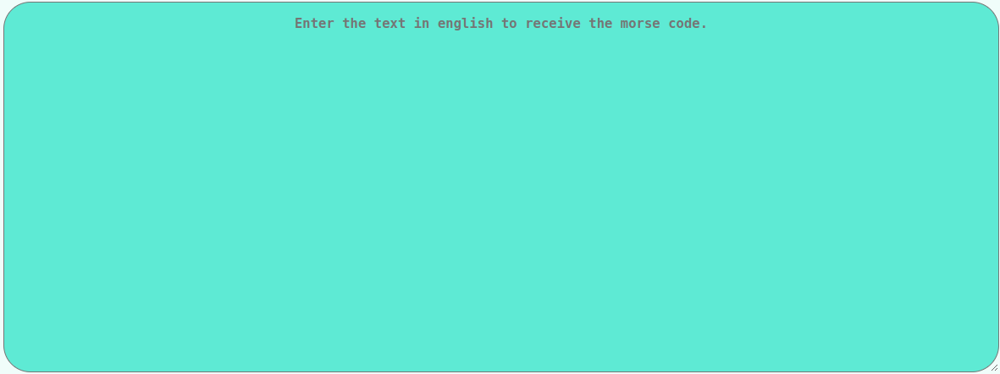
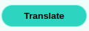
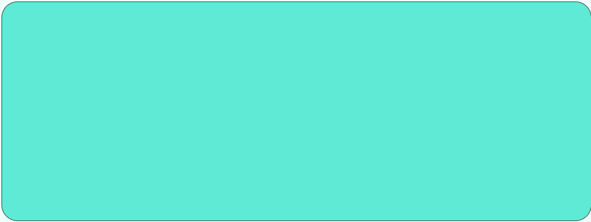

# Morse Code Translator

## Made Using HTML, CSS and JavaScript

Do you know about Morse Code - those dots and dashes? Do you find it cool just like I do? If yes, then this web-app is gonna amaze you!

This web-app is a Morse Code Translator and it can convert texts from english to morse code. All you have to do is write your text in englisgh in the **input field** and click on the **translate button**. Your translated text will appear in the **output field**, just below the translate button.

You can refer to the below images for a better understanding of the web-app.

1. Input Field

2. Translate Button

3. Output Field 

#### HAVE FUN TALKING DOTS AND DASHES!
